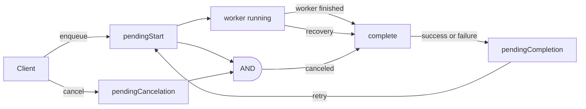
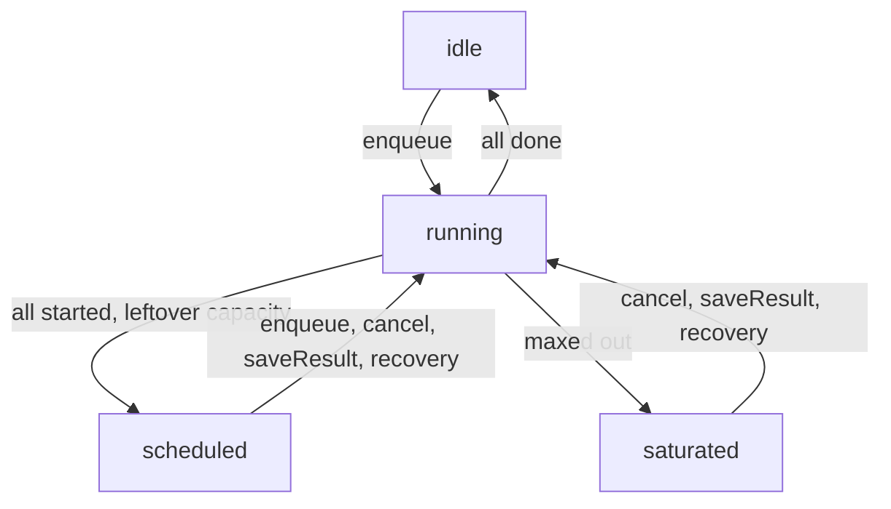

# Workpool: implementation notes and high-level architecture

Concepts:

- `segment`: A slice of time to process work. All work is bucketed into one.
  This enables us to batch work and avoid database conflicts.
- `generation`: A monotonically increasing counter to ensure the loop is only
  running one instance. If two loops start with the same generation, one will
  successfully increase it, the other will retry and find that the generation
  has changed and fail out.
- "Retention" is used to refer to situations where a query might have to read
  over a lot of "tombstones" - deleted data that hasn't been vacuumed from the
  underlying database yet. If there are frequent deletions, scanning across them
  can delay a query. Because of our delete-heavy queuing strategy, we have to be
  careful. Strategies are below.
- Cursors: A pointer to the last processed place in a table. In our case, they
  might allow data to be written before them if out-of-order writes happen, so
  we need to account for finding those "missed" writes on some granularity. We
  choose to wait until there isn't any immediate work to do before those scans.
  They help avoid retention issues.

## Data state machine

Notably:

- The pending\* states are written by outside sources.
- The main loop federates changes to/from "running"
- Canceling only impacts pending and retrying jobs.

## Loop state machine

- While the loop is running, the runStatus doesn't change, making it safer to
  read from clients without database conflicts.
- The "saturated" state is concretely "running" or "scheduled" at max
  parallelism. There is a boolean set on "scheduled" to avoid clients from
  kicking the main loop on enqueueing, which is unlikely to be productive, since
  the next action needs to be something terminating.

## Retention optimization strategy

- Producers (Client, Worker, Recovery) write to a future "segment".
- Consumers (main) read the current segment.
  - On conflicts, producers will write to progressively higher segments, while
    the main loop will continue to read the segment originally called with. This
    means conflicts are less likely on each retry.
- Patch singletons to avoid tombstones.
- Use segements & cursors to bound reads to latest data.
  - Do scans outside of the critical path (during load).
- Do point reads otherwise.
